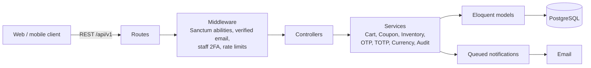
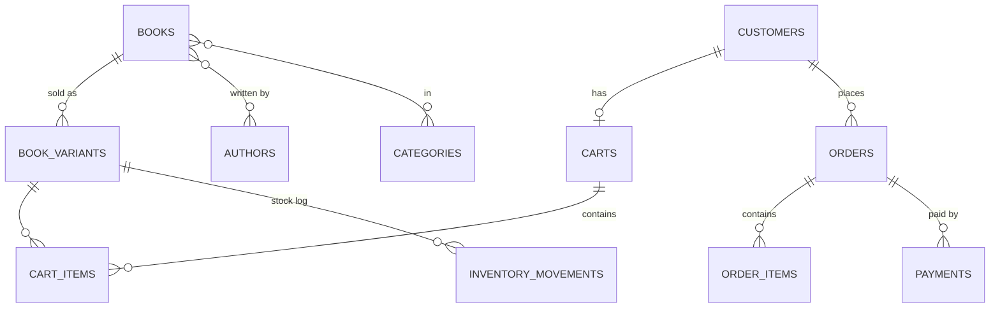

# Bookly — Backend API (v2)

A REST API for a bookstore e-commerce platform, built with **Laravel 13** and **PostgreSQL**.
It is a full rebuild of an earlier hand-rolled PHP backend, redesigned around a normalized (3NF) database, token authentication with two-factor login for staff, full-text search, and a shopping cart that never silently changes what the customer sees.

Frontend: [bookly_frontend](https://github.com/danishsary8/bookly_frontend)


## Features

**Customers**
- Register and log in with email + password, or with Google / Facebook
- 6-digit email codes to verify the account and to reset the password
- Browse and search the catalog: full-text search, filters (category, author, series, publisher, format, language, price, in stock) and sorting (relevance, newest, price, title, rating)
- Prices in USD and Cambodian riel (KHR), converted from the latest exchange rate
- Saved shipping addresses with one default
- Wishlist
- Shopping cart with stock checks, per-item limits and clear warnings when a price, stock level or availability changes after adding
- Coupon preview against the current cart
- Checkout with cash on delivery, order history and cancelling pending orders

**Staff and admins**
- Mandatory two-factor authentication with an authenticator app (TOTP)
- Manage books, formats (hardcover, paperback, ebook, audiobook), authors, categories, publishers and series
- Every stock change is recorded with who made it
- Every change made by staff is written to an audit log with before/after values
- Coupon management (percentage or fixed, minimum order, usage limits, validity dates)
- Order management: processing, shipping, delivery and cancellation, with full status history
- In-app low-stock alerts
- Staff can create and edit; deleting is admin-only and blocked when it would break history

## Tech stack

| Area | Choice |
| --- | --- |
| Framework | Laravel 13 (PHP 8.3) |
| Database | PostgreSQL 16 |
| Auth | Laravel Sanctum tokens, email OTP, RFC 6238 TOTP for staff, Laravel Socialite |
| Search | PostgreSQL full-text search (generated `tsvector` column + GIN index) |
| Queue | Laravel database queue (emails are sent in the background) |
| Tests | PHPUnit feature and unit tests against a real PostgreSQL database |

## Architecture



Business rules live in small service classes (for example `CartService`, `CouponService`, `InventoryService`) so controllers stay thin and the same rules can be reused by checkout.

### Data model

27 tables in third normal form, grouped by domain:

| Domain | Tables |
| --- | --- |
| Accounts | customers, staff_users, customer_addresses, verification_tokens |
| Catalog | books, book_variants, authors, publishers, categories, series, book_authors, book_categories |
| Inventory | inventory_movements |
| Cart | carts, cart_items, wishlists |
| Promotions | coupons |
| Orders | orders, order_items, order_status_history |
| Payments | payments, payment_webhook_logs |
| Returns | returns, return_items |
| Reviews | reviews |
| Admin | exchange_rates, admin_audit_logs |



### Design decisions worth noting

- **Formats as variants.** A book has shared details; each format (paperback, ebook, ...) is a `book_variants` row with its own price, stock and SKU.
- **Money in integer cents.** All totals and discounts are calculated in cents to avoid floating-point errors; the database stores `DECIMAL(10,2)`.
- **History is never lost.** Orders keep a copy of the shipping address and the price paid. Formats that were ordered can be deactivated but not deleted. Books are soft-deleted.
- **Stock has one entry point.** Every change goes through `InventoryService`, which locks the row and writes an `inventory_movements` entry.
- **Database-level rules.** CHECK constraints for statuses, formats, ratings and prices; unique constraints such as one format per book.
- **Security.** OTP codes are stored hashed and are single-use; staff TOTP codes cannot be replayed; login and code endpoints are rate-limited per email and per IP; customer and staff tokens carry different abilities so neither can reach the other's routes.
- **Safe checkout.** Placing an order locks the cart and the books in a fixed order, so two people buying the last copy at the same time get one order and one clear "not enough stock" error (checked with real parallel requests). An idempotency key stops a double click from creating two orders.
- **Performance.** The book list loads in a fixed number of queries regardless of page size (covered by a test).

## API overview

Base path: `/api/v1`. Full endpoint reference: [docs/API.md](docs/API.md).

| Area | Examples |
| --- | --- |
| Customer auth | `POST /auth/register`, `POST /auth/login`, `POST /auth/verify-email`, `POST /auth/social/{google\|facebook}` |
| Catalog | `GET /books?q=dragon&format=ebook&sort=price_asc`, `GET /books/{id}`, `GET /authors`, `GET /categories` |
| Shopping | `GET /cart`, `POST /cart/items`, `POST /cart/coupon/check`, `GET /wishlist`, `POST /addresses` |
| Staff auth | `POST /staff/auth/login`, `POST /staff/auth/two-factor/challenge` |
| Staff catalog | `POST /staff/books`, `POST /staff/books/{id}/variants`, `PATCH /staff/variants/{id}` |
| Checkout & orders | `POST /checkout/preview`, `POST /checkout` (with `Idempotency-Key`), `GET /orders`, `POST /orders/{id}/cancel` |
| Staff coupons | `GET /staff/coupons`, `POST /staff/coupons` |
| Staff orders | `GET /staff/orders`, `POST /staff/orders/{id}/status`, `GET /staff/notifications` |

Example: search the catalog

```http
GET /api/v1/books?q=dragon&in_stock=1&sort=relevance
Accept: application/json
```

```json
{
  "data": [
    {
      "id": 12,
      "title": "The Hobbit",
      "authors": [{ "id": 3, "name": "J. R. R. Tolkien" }],
      "price_from_usd": "12.50",
      "price_from_khr": "51250",
      "formats": ["paperback", "ebook"],
      "in_stock": true,
      "rating_avg": 4.8,
      "review_count": 21
    }
  ],
  "links": { "...": "..." },
  "meta": { "current_page": 1, "per_page": 20, "total": 1 }
}
```

## Getting started

Requirements: PHP 8.3+, Composer, PostgreSQL 14+.

```bash
git clone https://github.com/danishsary8/bookly_backend_v2.git
cd bookly_backend_v2
composer install
cp .env.example .env
php artisan key:generate
```

Create the database user and databases (or adjust `DB_*` in `.env`):

```sql
CREATE USER bookshop WITH PASSWORD 'bookshop';
CREATE DATABASE bookshop_v2 OWNER bookshop;
CREATE DATABASE bookshop_v2_test OWNER bookshop;
```

```bash
php artisan migrate
php artisan staff:create-admin      # first admin account (password is asked for)
php artisan serve                   # http://localhost:8000/api/v1/ping
php artisan queue:work              # sends verification emails
```

Optional `.env` values: `MAIL_*` for real email delivery, `GOOGLE_CLIENT_ID/SECRET` and `FACEBOOK_CLIENT_ID/SECRET` for social login.

## Running the tests

```bash
php artisan test
```

124 tests run against the `bookshop_v2_test` PostgreSQL database (the schema uses PostgreSQL features, so SQLite is not used).

## Project status and roadmap

- [x] Database schema, models and factories
- [x] Authentication: customers (email OTP, Google/Facebook) and staff (mandatory TOTP 2FA)
- [x] Catalog API with search, filters and sorting; staff catalog management with audit log
- [x] Addresses, cart, wishlist and coupons
- [x] Checkout, orders and stock deduction (cash on delivery)
- [ ] Returns and verified-purchase reviews
- [ ] Admin dashboard, staff management, exchange rates
- [ ] Card, PayPal and Bakong KHQR payments with webhooks
- [ ] Structured logging and error tracking

Progress notes for each step are kept in [docs/WORKLOG.md](docs/WORKLOG.md).

## Author

Built by [danishsary8](https://github.com/danishsary8).
